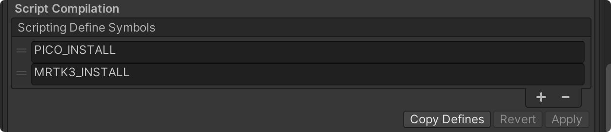
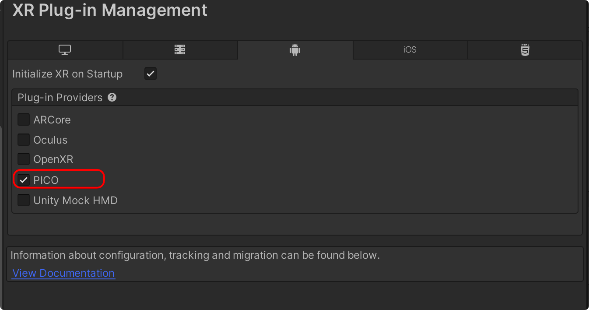
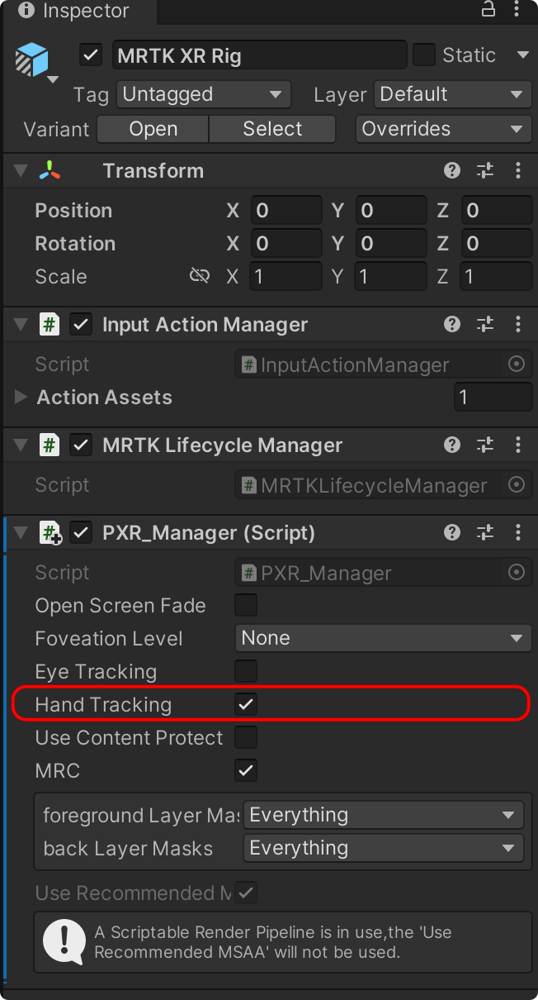
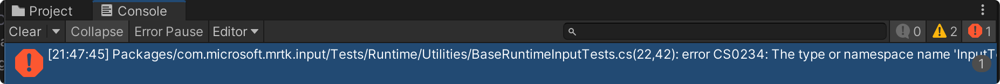

# PicoMRTK3

Compatible with **Pico 4** devices. 

MRTK3 is the third generation of Microsoft Mixed Reality Toolkit for Unity. It's a Microsoft-driven open source project to accelerate cross-platform mixed reality development in Unity. This new version is built on top of Unity's XR Management system and XR Interaction Toolkit. Here are some of its functions:

- Provides the cross-platform input system and building blocks for spatial interactions and UI.
- Enables rapid prototyping via in-editor simulation that allows you to see changes immediately.
- Operates as an extensible framework that allows developers the ability to swap out core components.


We hear your excitement, and we want to give you early access to our newest features and invite you to take part in shaping our future iterations through your feedback. MRTK3 is now in public preview, which represents our current snapshot in development. Some features are still missing, broken, or otherwise not at parity with MRTK 2.x. We appreciate your patience while we shape the future of MRTK and we look forward to your feedback and suggestions. We’re excited to give you a glimpse of what is to come!

<table width="100%">
<tr>
 <td>
 
  https://user-images.githubusercontent.com/82647748/209443143-1da3b52a-ff5f-40ef-8b58-613346bd81bd.mp4
 
 </td>

 <td>
  
  https://user-images.githubusercontent.com/82647748/209443146-9b4ef77f-57ea-46b1-a4a7-1e39ca770820.mp4

</td>
</tr>

</table>


## Build APK
1. Clone this project
2. Go to `Build Settings` to build, the same way you used to build.


## Get Started With Your Project

1. Clone this project
2. Copy the Packages directory under the project to your project
3. Copy all files under Assets/Scripts to your project
4. Set up your Pico-MRTK project settings






## Error


Copy the following json into your manifest.json
```json
  "testables": [
    "com.unity.inputsystem"
  ]
```


Copy the following package into your manifest.json

```
"com.microsoft.mrtk.graphicstools.unity": "https://github.com/microsoft/MixedReality-GraphicsTools-Unity.git?path=/com.microsoft.mrtk.graphicstools.unity#v0.4.0",
```

## Social

WeChat: falcon106
